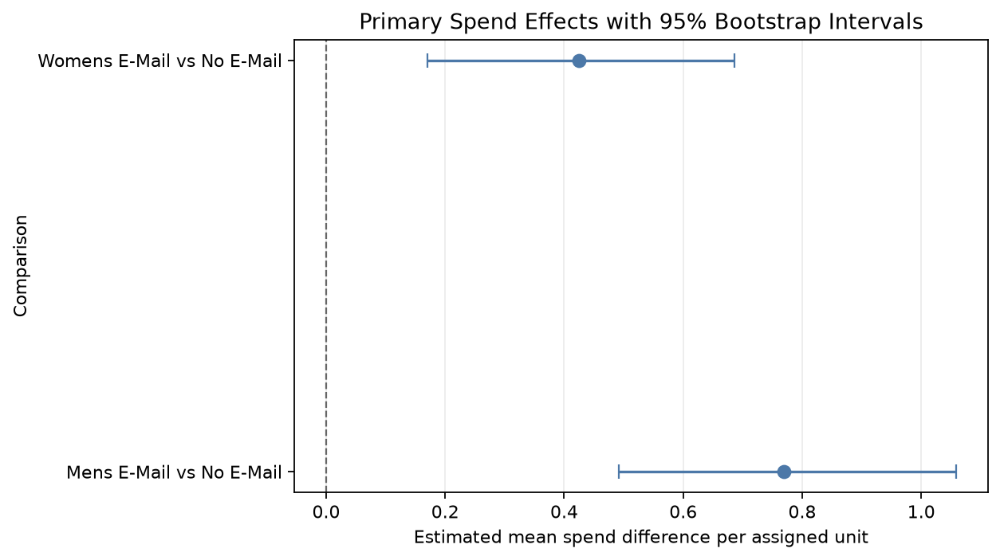
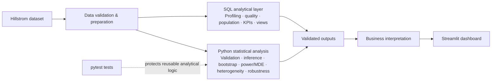
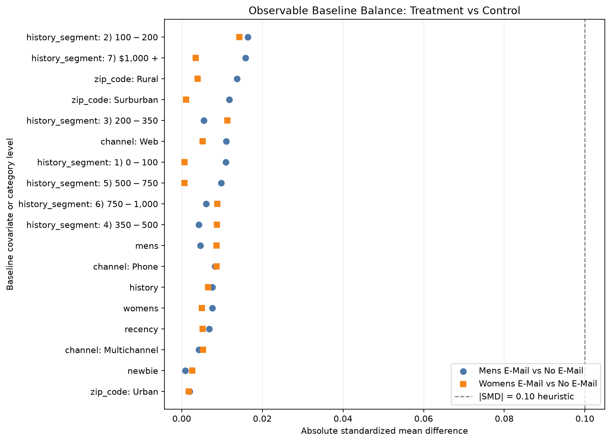
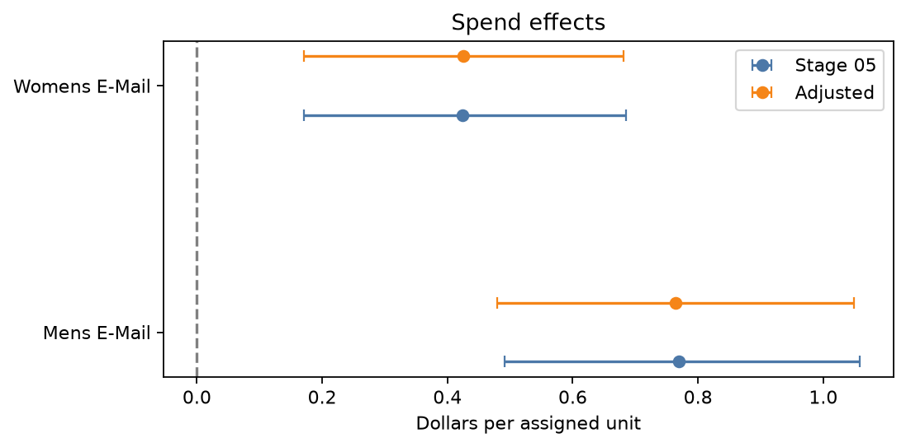

# Hillstrom Email Experiment

**Live Dashboard:** [https://hillstrom-ab-testing-analysis-cnezxrwubpb8twdcudvwrp.streamlit.app/](https://hillstrom-ab-testing-analysis-cnezxrwubpb8twdcudvwrp.streamlit.app/)

## End-to-End A/B Testing & Experimentation Analysis

A 64,000-customer randomized email experiment analyzed with Python, statistical inference, PostgreSQL-compatible SQL, experiment diagnostics, power analysis, heterogeneous treatment effects, robustness checks, automated testing, and a Streamlit dashboard.

## Executive Summary

This project evaluates whether Mens E-Mail and Womens E-Mail changed customer visits, conversions, and spend relative to a No E-Mail control. It covers the full workflow: data integrity, experiment validation, inference, power/MDE, exploratory heterogeneity, robustness, SQL reporting, and dashboard communication.

The primary project outcome is **mean spend per assigned customer**. Conversion rate and visit rate are secondary outcomes.

## Key Results

| Metric | Mens E-Mail vs Control | Womens E-Mail vs Control |
|---|---:|---:|
| Incremental spend / customer | +$0.77 | +$0.42 |
| Conversion effect | +0.68 pp | +0.31 pp |
| Visit effect | +7.66 pp | +4.52 pp |
| Incremental spend / 1,000 assigned | +$769.83 | +$424.41 |
| Additional conversions / 1,000 | +6.81 | +3.11 |
| Additional visits / 1,000 | +76.59 | +45.23 |

Both email treatments produced positive estimated effects versus No E-Mail across measured outcomes. Mens E-Mail produced the larger observed point estimates, but Mens-versus-Womens was not a primary confirmatory comparison and is not claimed as formal superiority.

### Primary outcome: spend

| Comparison | Mean spend effect | 95% bootstrap CI | Holm-adjusted p-value |
|---|---:|---:|---:|
| Mens E-Mail vs No E-Mail | +$0.7698 | +$0.4916 to +$1.0588 | 2.33e-7 |
| Womens E-Mail vs No E-Mail | +$0.4244 | +$0.1707 to +$0.6857 | 0.00113 |

## Architecture

## Business Interpretation

At 1,000 assigned customers, the experiment implies +$769.83 expected spend, +6.81 conversions, and +76.59 visits for Mens E-Mail; Womens E-Mail implies +$424.41, +3.11, and +45.23 respectively. These are experiment-scaled estimates, not future profit forecasts.

**Incremental Profit per Assigned Customer** = Incremental Spend × Contribution Margin − Incremental Campaign Cost per Assigned Customer.

Contribution margin, campaign cost, fulfillment cost, customer lifetime value, and future reachable audience are unavailable. The project therefore does not calculate profitability or ROI.

## Experiment Design and Validation

| Element | Definition |
|---|---|
| Experimental unit | Likely customer or assigned recipient; unverified without an ID |
| Treatment variable | segment |
| Control | No E-Mail |
| Treatments | Mens E-Mail; Womens E-Mail |
| Assignment counts | 21,306 control; 21,307 Mens; 21,387 Womens |
| Primary metric | Mean spend per assigned customer |
| Secondary outcomes | Conversion rate; visit rate |

The project framework was defined before primary testing; this does not imply the original experiment was preregistered.

The data contains 64,000 rows and 12 columns. No missing values or invalid outcome relationships were detected.

- **SRM:** χ² = 0.2025, p = 0.9037; no evidence against assumed equal one-third allocation.
- **Balance:** largest |SMD| = 0.0164; no observed |SMD| exceeded the 0.10 heuristic.
- **Repeated records:** 6,562 exact repeated rows were retained. Without a customer ID, identical records do not prove duplicated experimental units, and dropping them could bias estimates.

These diagnostics support the credibility of the observed comparison but do not independently prove perfect randomization.

## Analytical Workflow

Data Understanding → Data Integrity → EDA → Experiment Validation → Primary Treatment Effects → Power & MDE → Exploratory Heterogeneity → Robustness → SQL Analytics → Business Interpretation → Streamlit Dashboard

| Notebook | Purpose |
|---|---|
| [01](notebooks/01_data_understanding.ipynb) | Data understanding |
| [02](notebooks/02_data_cleaning.ipynb) | Data integrity |
| [03](notebooks/03_exploratory_analysis.ipynb) | Exploratory analysis |
| [04](notebooks/04_experiment_validation.ipynb) | Experiment validation |
| [05](notebooks/05_frequentist_testing.ipynb) | Primary treatment effects |
| [06](notebooks/06_power_analysis.ipynb) | Power and MDE |
| [07](notebooks/07_segment_analysis.ipynb) | Exploratory heterogeneity |
| [08](notebooks/08_advanced_analysis.ipynb) | Robustness analysis |

## Statistical Methodology

Spend uses the treatment-control difference in mean spend per assigned customer, percentile bootstrap confidence intervals, Welch mean comparison as reference inference, and Holm correction. Binary outcomes use two-sample proportion inference, absolute risk differences, confidence intervals, and Holm correction.

Spend is approximately 99% zero and strongly right-skewed. Mean spend remains the relevant expected-revenue-per-assigned-customer estimand; median spend is zero for nearly every group. Bootstrap uncertainty and robustness checks address this distributional challenge.

## Experiment Sensitivity

| Outcome | Control baseline | 80% MDE |
|---|---:|---:|
| Conversion | 0.5726% | +0.223 pp |
| Visit | 10.6167% | +0.850 pp |

Detecting a +0.10 percentage-point conversion effect at 80% power would require approximately 96,971 customers per group under the planning assumptions. Very small conversion improvements require substantially larger experiments.

## Exploratory Treatment Heterogeneity

The analysis explored channel, zip_code, newbie, history_segment, mens, and womens:

- 114 subgroup comparisons
- 13 raw interaction p-values below 0.05
- 6 signals notable after Benjamini-Hochberg FDR adjustment

These findings are exploratory and hypothesis-generating, not targeting recommendations. Small arms and sparse conversion events were flagged; prospective experiments are required before targeting decisions.

## Robustness Checks

Stage 05 remains the primary analysis. Stage 08 is supporting analysis.

| Spend comparison | Mens E-Mail | Womens E-Mail |
|---|---:|---:|
| Stage 05 primary | +$0.770 | +$0.424 |
| Covariate-adjusted | +$0.764 | +$0.426 |
| Adjusted 95% CI | +$0.479 to +$1.049 | +$0.170 to +$0.681 |
| Permutation p-value | 0.0001 | 0.0014 |
| Excluding top 20 global spend observations | +$0.638 | +$0.379 |

Effects attenuate somewhat when the largest transactions are excluded, particularly for Mens E-Mail, but remain directionally positive. No major qualitative reversal occurred across bootstrap, conventional mean inference, adjustment, permutation, and extreme-value diagnostics.

## SQL Analytics Layer

The ordered [PostgreSQL-compatible workflow](sql/README.md) is:

[01 Schema](sql/01_schema.sql) → [02 Profiling](sql/02_data_profiling.sql) → [03 Data Quality](sql/03_data_quality.sql) → [04 Experiment Population](sql/04_experiment_population.sql) → [05 Experiment Health](sql/05_experiment_health.sql) → [06 Funnel](sql/06_funnel_analysis.sql) → [07 Experiment Metrics](sql/07_experiment_metrics.sql) → [08 Segment Analysis](sql/08_segment_analysis.sql) → [09 Analytical Views](sql/09_analytical_views.sql)

It demonstrates schema constraints, CASE, CTEs, FILTER, conditional aggregation, NULLIF, ordered-set medians, window functions, views, experiment-population construction, and KPI reporting. PostgreSQL was not installed locally, so SQL was validated against equivalent Python aggregations rather than claimed as native execution.

## Reusable Analytical Code

Notebooks retain reasoning and interpretation. [src](src) contains tested implementations:

~~~text
src/
├── metrics.py
├── statistical_tests.py
├── power_analysis.py
└── segmentation.py
~~~

These modules cover bootstrap intervals, Welch and proportion inference, Holm, SMDs, MDE/sample-size calculations, zero-inflated spend simulation, subgroup effects, and FDR handling.

## Testing & Reproducibility

The focused pytest suite contains **21 tests**: **21 passed in approximately 1.06 seconds** in the validation environment. It covers metrics, bootstrap reproducibility, Welch inference, proportions, Holm, SMDs, MDE/sample size, zero-inflated spend simulation, segmentation, sparse-event handling, and FDR.

Tests prioritize material analytical behavior over arbitrary 100% coverage. Integration-level reproducibility re-executes Stages 04–07 and reconciles validated outputs. See [tests](tests) and [pytest.ini](pytest.ini).

## Interactive Dashboard

[dashboard/app.py](dashboard/app.py) presents executive results, effects and confidence intervals, per-1,000 interpretation, funnel, experiment health, power/MDE, interactive exploratory segments, robustness, profitability framework, methodology, and limitations. See [dashboard/README.md](dashboard/README.md).

~~~bash
streamlit run dashboard/app.py
~~~

No hosted dashboard URL is claimed.

## Repository Structure

~~~text
.
├── data/
│   ├── raw/
│   └── processed/
├── notebooks/
├── src/
├── sql/
├── tests/
├── outputs/
│   ├── figures/
│   ├── tables/
│   └── reports/
├── dashboard/
├── README.md
├── requirements.txt
├── pytest.ini
└── AGENTS.md
~~~

## Technology Stack

Python · Pandas · NumPy · SciPy · Statsmodels · Matplotlib · Jupyter · PostgreSQL-compatible SQL · Streamlit · pytest

## Limitations

- No customer ID, timestamp, documented allocation ratio, or documented outcome window is available.
- Repeated records cannot be independently identified as duplicate experimental units.
- Original preregistration, hypotheses, and primary endpoint are unavailable.
- Spend is highly zero-inflated and right-skewed.
- Subgroup findings are exploratory.
- Campaign economics and external validity are uncertain.
- SQL was not executed in native PostgreSQL locally.

## How to Run

1. Clone the repository and create a virtual environment.

   ~~~bash
   python -m venv .venv
   source .venv/bin/activate
   ~~~

   Windows activation:

   ~~~powershell
   .venv\Scripts\activate
   ~~~

2. Install dependencies.

   ~~~bash
   pip install -r requirements.txt
   ~~~

3. Obtain the Hillstrom CSV from the original MineThatData source and save it as `data/raw/Hillstrom.csv`. The dataset is not redistributed here because its public source does not provide explicit redistribution license terms. See [data/README.md](data/README.md) for provenance, checksums, and local setup.

   Before executing notebooks, run the existing Stage 02 workflow to create or validate `data/processed/Hillstrom_clean.csv`.

4. Launch Jupyter and run notebooks in numeric order.

   ~~~bash
   jupyter notebook
   ~~~

5. Run tests and launch the dashboard.

   ~~~bash
   pytest
   streamlit run dashboard/app.py
   ~~~

## Key Takeaways

- Both email treatments produced positive estimated effects versus No E-Mail.
- Mens E-Mail produced larger observed point estimates, but direct superiority was not the primary confirmatory test.
- Primary spend effects remained broadly stable across robustness specifications.
- Experiment-health diagnostics found no observable major allocation or baseline-balance problem.
- Heterogeneity signals are hypotheses for future validation.
- Campaign deployment requires actual contribution margin and campaign-cost inputs.

For the detailed business narrative, see [business_interpretation.md](outputs/reports/business_interpretation.md).
